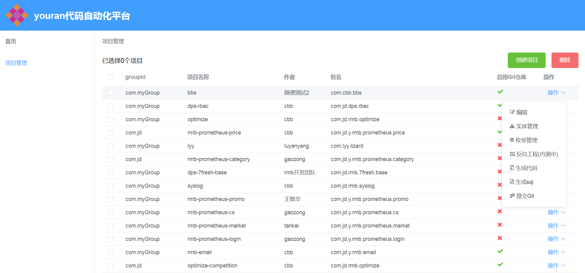
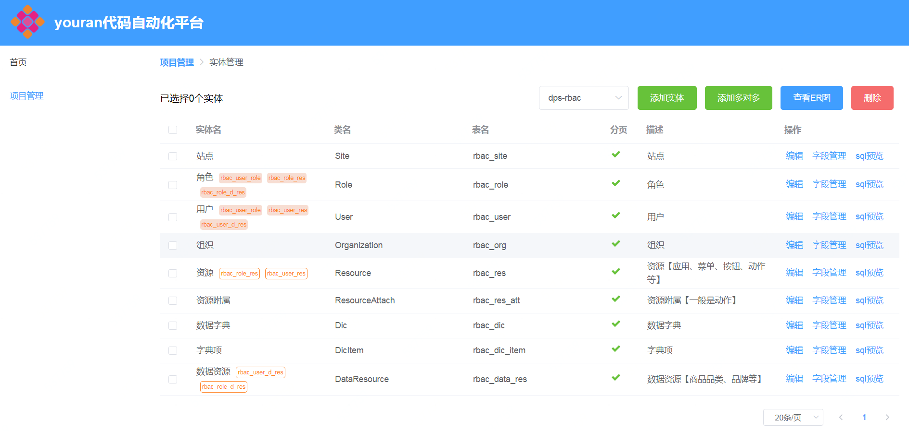
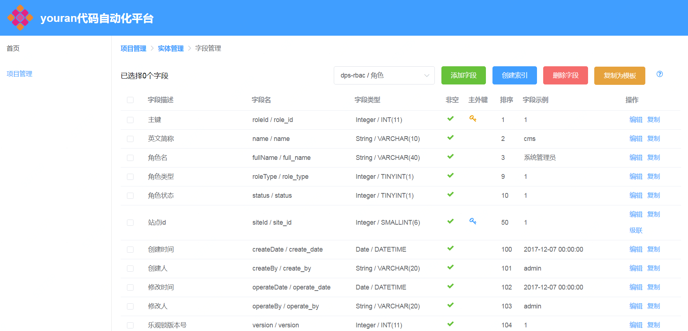

# youran代码自动化平台

通过维护元数据，一键生成java后端基础架构，同时还能生成增删改查代码和单元测试。
生成的项目是基于[spring-boot](https://spring.io/projects/spring-boot/)+[mybatis](http://www.mybatis.org/mybatis-3/)架构；其他附属技术栈包括：
- [hibernate-validator](http://hibernate.org/validator/releases/)
- [swagger](https://swagger.io/)(API文档自动生成)
- [mapstruct](http://mapstruct.org/)(属性映射)
- 基于[H2](http://www.h2database.com)内存数据库的单元测试

## 创建本地数据库
1. 先修改数据库配置：[youran-generate/src/main/resources/application-local.yml](./youran-generate/src/main/resources/application-local.yml)
2. 建表语句参考：[youran-generate/src/test/resources/DB/generate.sql](./youran-generate/src/test/resources/DB/generate.sql)

## 安装部署

简易安装（推荐）
``` bash

# 直接用maven编译
mvn clean package

# 运行spring-boot项目
java -jar youran-generate/target/youran-generate.war

```

复杂安装（自己编译UI）
``` bash
# 安装前端项目npm依赖
cd youran-generate-ui
npm install

# 开发模式启动前端环境
# npm run dev

# 将前端资源编译到后端项目中
# 编译目标路径：youran-generate/src/main/resources/ui
npm run build

# 后端代码编译打包
cd ../
mvn clean package

# 运行spring-boot项目
java -jar youran-generate/target/youran-generate.war

```
### 项目管理页面

### 实体管理页面

### 字段管理页面

### 字段添加页面


## 术语解析
1. 项目：项目就是一个独立的应用系统，可以基于一个项目生成一整套JavaWeb后端服务系统。
2. 实体：一个实体对应数据库里一张业务表，同时对应后端一整套增删改查服务，同时实体之间也可以有‘一对多’，‘多对多’等关联关系。
3. 字段：这里的字段既是数据库业务表中的字段，也是java实体类中的字段，一个字段有非常多的属性可以配置。
4. 枚举：建议将不常变化的一类常量数据创建成枚举，会在java代码中生成对应的enum类。
5. 枚举值：枚举类中的字段，有值(value)和描述(desc)两个属性。
6. 索引：就是mysql业务表中的索引。


## 特色功能
1. 字段复制：支持将已经存在的字段复制，并在指定实体内粘贴，同时支持直接粘贴内置的模板字段。
2. 基于git增量生成代码[点击查看原理](/doc/IncrementalGeneration.md)：支持将代码直接生成到远程git仓库，同时支持在数据变动以后再次生成（只生成差异部分）。
3. 多对多关系：支持在两个实体之间的建立多对多关联关系，会在mysql中生成一张关联表，可以设置两个实体之间是否持有对方引用，持有引用的一方会自动生成维护关联关系的rest服务。
4. 外键关联：在添加字段的时候，可以设置该字段是否外键，外键字段需要关联某个实体的主键，从而可以实现‘一对一’或‘一对多’关联。
5. 外键级联扩展：设置成外键的字段上可以配置级联字段，级联字段是外键对应的关联表中的业务字段，级联字段可以作为查询条件，也能作为返回结果展示。
6. 反向工程：如果您的应用已经完成了表结构设计，请使用'反向工程'功能将建表语句反向导入项目中，自动生成实体和字段。
7. 实体ER图：可以在实体列表页选择多个存在关联关系的实体，点击'查看ER图'按钮，即可生成实体关系图。
8. 帮助文档：使用本系统的过程中，每个表单项后面都有帮助按钮，可以查看该输入项的详细说明。

## 使用说明

一、最佳方案`推荐`（在本工程中进行模型设计，代码同步到git）
0. 在gitlab或github之类的代码平台上创建空的工程
1. 本系统中创建项目并录入git地址
2. 创建实体
3. 创建实体字段
4. 创建枚举及枚举字段【可选】
5. 创建多对多关联关系【可选】
6. 创建字段索引【可选】
7. 执行“提交Git”


二、传统方案`不推荐`（设计完表结构后执行反向工程）
0. 提前设计好表结构
1. 创建项目
2. 执行反向工程将建表语句导入项目中
3. 调整字段的属性（因为反向工程导入的字段信息量太少，部分属性设置了默认值）
4. 创建枚举及枚举字段【可选】
5. 创建多对多关联关系【可选】
7. 生成代码


## 升级日志

#### 2019-02-27
- 新增java类型Boolean

#### 2018-11-29
- 支持spring-boot1和2两个版本的自由选择

#### 2018-10-19
- 增加项目中文名称字段

#### 2018-07-17
- 支持查看ER图

#### 2018-07-12
- 使用标准java doc风格的类注释
- 删除枚举管理页面，字段列表页中增加枚举维护功能
- 可以配置对枚举字段增加唯一性校验

#### 2018-06-19
- 增加国际化支持

#### 2018-06-14
- 切换mybatis的使用姿势：用传统的Mapper注解模式替换SqlSession模式

#### 2018-05-31
- 增加反向工程功能

#### 2018-05-30
- 外键字段增加级联扩展功能
- core模块中增加默认配置文件，并设置mybatis.config-location

#### 2018-05-08
- 多对多关联表中增加创建时间字段

#### 2018-04-10
- 项目实体中增加groupId字段

#### 2018-03-17
- 增加将代码生成到远程Git仓库的功能

#### 2018-03-09
- 增加前端编辑表单中每个字段的详细说明（markdown格式）

#### 2018-03-08
- 生成Maven模块化代码

#### 2018-03-07
- 移除fastjson依赖，统一换成jackson
- 修改下载代码压缩包文件名（带上项目名称）
